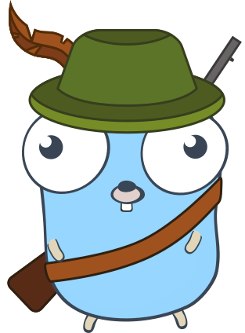

# Pirsch

[](https://pkg.go.dev/github.com/pirsch-analytics/pirsch?status)
[](https://goreportcard.com/report/github.com/pirsch-analytics/pirsch)
<a href="https://discord.gg/fAYm4Cz"></a>

Pirsch is a server side, no-cookie, drop-in and privacy focused tracking solution for Go. Integrated into a Go application it enables you to track HTTP traffic without invading the privacy of your visitors. The visualization of the data (dashboard) is not part of this project.

**If you're looking for a managed solution with an easy-to-use API and JavaScript integration, check out https://pirsch.io/.**

## How does it work?

Pirsch generates a unique fingerprint for each visitor. The fingerprint is a hash of the visitors IP, User-Agent, the date, and a salt.

Each time a visitor opens your page, Pirsch will store a hit. The hits are analyzed using the `Analyzer` to extract meaningful data.

The tracking works without invading the visitor's privacy as no cookies are used nor required. Pirsch can track visitors using ad blockers that block trackers like Google Analytics.

## Features

* unique visitor count per day, path, and hour
* session count
* bounce rate
* view count
* growth (unique visitors, sessions, bounces, views, average session duration)
* average time on page
* average session duration
* languages
* operating system and browser (including versions)
* referrers
* countries
* cities
* platform
* screen size
* UTM query parameters for campaign tracking
* entry and exit pages
* custom event tracking
* conversion goals

All timestamps are stored as UTC. Starting with version 2.1, the results can be transformed to the desired timezone. All data points belongs to an (optional) client, which can be used to split data between multiple domains for example. If you just integrate Pirsch into your application, you don't need to care about that field. **But if you do, you need to set a client ID for all columns!**

## Usage

To store hits and statistics, Pirsch uses ClickHouse. Database migrations can be run manually be executing the migrations steps in `schema` or by using the automatic migration.

**Make sure you read the changelog before upgrading! There are sometimes manual steps required to migrate the data to the new version.**

### Server-side tracking

Here is a quick demo on how to use the library:

```Go
// Set the key for SipHash. This should be called on startup (before generating the first fingerprint) and is NOT concurrency save.
tracker.SetFingerprintKeys(42, 123)

dbConfig := &db.ClientConfig{
    Hostname:      "127.0.0.1",
    Port:          9000,
}

// Migrate the database.
db.Migrate(dbConfig)

// Create a new ClickHouse client to store data.
store, _ := db.NewClient(dbConfig)

// Set up a default tracker with a salt.
// This will buffer and store hits and generate sessions by default.
pirschTracker := tracker.NewTracker(store, "salt", &tracker.Config{
    SessionCache: session.NewMemCache(store, 100),
})

// Create a handler to serve traffic.
// We prevent tracking resources by checking the path. So a file on /my-file.txt won't create a new hit
// but all page calls will be tracked.
http.Handle("/", http.HandlerFunc(func(w http.ResponseWriter, r *http.Request) {
    if r.URL.Path == "/" {
        go pirschTracker.Hit(r, nil)
    }

    w.Write([]byte("<h1>Hello World!</h1>"))
}))

// And finally, start the server.
// We don't flush hits on shutdown but you should add that in a real application by calling Tracker.Flush().
log.Println("Starting server on port 8080...")
http.ListenAndServe(":8080", nil)
```

The secret salt passed to `NewTracker` should not be known outside your organization as it can be used to generate fingerprints equal to yours.
Note that while you can generate the salt at random, the fingerprints will change too. To get reliable data configure a fixed salt and treat it like a password.

To analyze hits and processed data you can use the `Analyzer`, which provides convenience functions to extract useful information.

```Go
// This also needs access to the store.
pirschAnalyzer := analyzer.NewAnalyzer(store)

// As an example, lets extract the total number of visitors.
// The filter is used to specify the time frame you're looking at (days) and is optional.
// If you pass nil, the Analyzer returns statistics for all hits (be careful about that!).
visitors, err := pirschAnalyzer.Visitors(&analyzer.Filter{
    From: yesterday(),
    To: today()
})
```

### Client-side tracking

You can also track visitors on the client side by adding `pirsch.js`/`pirsch-events.js` to your website. It will perform a GET request to the configured endpoint.

```HTML
<!-- add the tracking script to the head area and configure it using attributes -->
<script type="text/javascript" src="js/pirsch.js" id="pirschjs"
        data-endpoint="/count"
        data-client-id="42"
        data-exclude="/path/to/exclude,/regex/.*"
        data-domain="foo.com,bar.com"
        data-dev
        data-param-optional-param="test"></script>
```

The parameters are configured through HTML attributes. All of them are optional, except for the `id`. Here is a list of the possible options.

| Option | Description | Default |
| - | - | - |
| data-endpoint | The endpoint to call. This can be a local path, like /tracking, or a complete URL, like http://mywebsite.com/tracking. It must not contain any parameters. | /pirsch |
| data-client-id | The client ID to use, in case you plan to track multiple websites using the same backend, or you want to split the data. Note that the client ID must be validated in the backend. | 0 (no client) |
| data-exclude | Specifies a list of regular expressions to test against. On a match, the page view or event will be ignored. | (no paths) |
| data-domain | Specifies a list of additional domains to send data to. | (empty list) |
| data-dev | Enable tracking hits on localhost. This is used for testing purposes only. | false |
| data-disable-query | Removes all query parameters from the URL. | false |
| data-disable-referrer | Disables the collection of the referrer. | false |
| data-disable-resolution | Disables the collection of the screen resolution. | false |
| data-param-* | Additional parameters to send with the request. The name send is everything after `data-param-`. | (no parameters) |

The scripts can be disabled by setting the `disable_pirsch` variable in localStorage of your browser.

To track the hits you need to call `Hit` from the endpoint that you configured for `pirsch.js`. Here is a simple example.

```Go
// Create an endpoint to handle client tracking requests.
// HitOptionsFromRequest is a utility function to process the required parameters.
// You might want to additional checks, like for the client ID.
http.Handle("/count", http.HandlerFunc(func(w http.ResponseWriter, r *http.Request) {
    trackerTracker.Hit(r, tracker.HitOptionsFromRequest(r))
}))
```

`HitOptionsFromRequest` will read the parameters send by `pirsch.js` and returns a new `HitOptions` object that can be passed to `Hit`. You might want to split these steps into two, to run additional checks for the parameters that were sent by the user.

### Custom Event Tracking

Custom events are conceptually the same as hits, except that they have a name and hold additional metadata. To create an event, call the tracker and pass in the additional fields.

```Go
http.Handle("/", http.HandlerFunc(func(w http.ResponseWriter, r *http.Request) {
    if r.URL.Path == "/" {
    	// The name in the options is required!
		options := tracker.EventOptions{
            Name: "my-event",
            Duration: 42, // optional field to save a duration, this will be used to calculate an average time when using the analyzer
            Meta: map[string]string{ // optional metadata, the results can be filtered by them
                "http_status": "200",
                "product_id": "123",
            },
        }
        go pirschTracker.Event(r, options, nil)
    }

    w.Write([]byte("<h1>Hello World!</h1>"))
}))
```

There are two methods to read events using the `Analyzer`. `Analyzer.Events` returns a list containing all events and metadata keys. `Analyzer.EventBreakdown` breaks down a single event by grouping the metadata fields by value. You have to set the `Filter.EventName` and `Filter.EventMetaKey` when using this function. All other analyzer methods can be used with an event name to filter for an event.

### Mapping IPs to countries and cities

Pirsch uses MaxMind's [GeoLite2](https://dev.maxmind.com/geoip/geoip2/geolite2/) database to map IPs to countries. The database **is not included**, so you need to download it yourself. IP mapping is optional, it must explicitly be enabled by setting the GeoDB attribute of the `TrackerConfig` or through the `HitOptions` when calling `HitFromRequest`.

1. create an account at MaxMind
2. generate a new license key
3. call `geodb.Get` with the path you would like to extract the tarball to and pass your license key
4. create a new GeoDB by using `NewGeoDB` and the file you downloaded and extracted using the step before

The GeoDB should be updated on a regular basis. The Tracker has a method `SetGeoDB` to update the GeoDB at runtime (thread-safe).

## Documentation

Read the [full documentation](https://godoc.org/github.com/pirsch-analytics/pirsch) for details, check out `demos`, or read the article at https://marvinblum.de/blog/server-side-tracking-without-cookies-in-go-OxdzmGZ1Bl.

## Building pirsch.js and pirsch-events.js

To minify `pirsch.js`/`pirsch-events.js` to `pirsch.min.js`/`pirsch-events.min.js` you need to run `npm i` and `npm run minify` inside the `js` directory.

## Things to maintain

The following things need regular maintenance/updates (using the scripts in the `scripts` directory when possible):

* Go and JS dependencies
* referrer blacklist
* User-Agent blacklist
* browser version mapping
* os version mapping
* referrer mapping (grouping)

GeoDB updates itself if used.

## Changelog

See [CHANGELOG.md](CHANGELOG.md).

## Contribution

Contributions are welcome! Please open a pull requests for your changes and tickets in case you would like to discuss something or have a question.

To run the tests you'll need a ClickHouse database, and a schema called `pirschtest`. The user is set to `default` (no password).

Note that we only accept pull requests if you transfer the ownership of your contribution to us. As we also offer a managed commercial solution with this library at its core, we want to make sure we can keep control over the source code.

## License

GNU AGPLv3

<p align="center">
    
</p>
